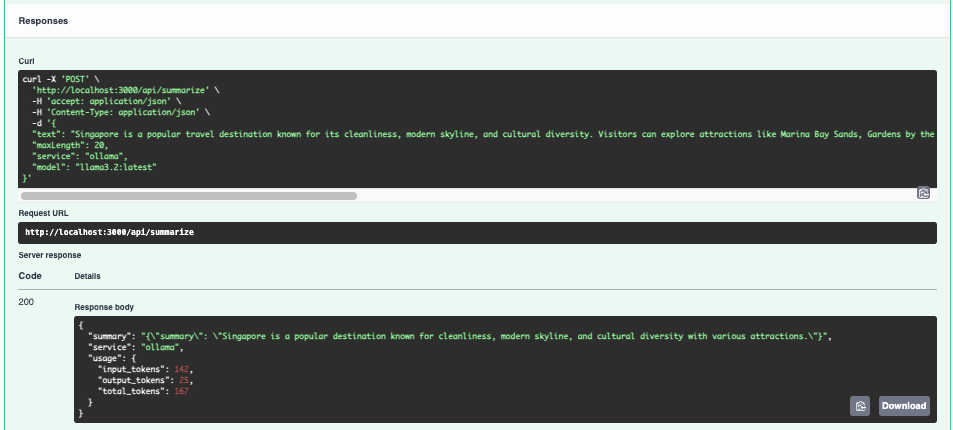

# AIBackends

AIBackends is an API server that you can use to integrate AI into your applications. It is a turnkey and cost effective solution for your AI integration needs. 

The project supports open source models using Ollama. 

Goal is to make common AI use cases easily accessible so you can skip the heavy lifting of understanding prompt engineering and model selection and focus on integrating AI into your application or workflow.


## Architecture

Hono is used to create the API.
Zod is used to validate the request and response schemas.
Multiple AI services (OpenAI, Ollama) are currently supported.

## Available Endpoints

- **/api/summarize**: Summarize text
- **/api/translate**: Translate text
- **/api/sentiment**: Analyze sentiment
- **/api/keywords**: Extract keywords
- **/api/describeImage**: Describe an image
- More to come...

## Summarize example


## Supported AI Providers

### Ollama
- Connects to local or remote Ollama instances
- Supports structured output (JSON mode)
- Model selection is done in the request body

### OpenAI
- Uses the official OpenAI TypeScript SDK
- Supports structured output with Zod schemas
- Requires API key configuration

### Service Selection
'ollama' is the default service. 'openai' is also supported. You need to send the service and model name in the request body. See examples below.

## Environment Setup

Create a `.env` file in the root directory of this project and configure your preferred AI services:

### OpenAI Configuration (Cloud-based)

```env
# OpenAI API Key (required for OpenAI service)
OPENAI_API_KEY=your-openai-api-key
OPENAI_MODEL=gpt-4.1
```

### Ollama Configuration (Self-hosted)

```env
# Ollama Configuration (for local/self-hosted models)
OLLAMA_ENABLED=true
OLLAMA_BASE_URL=http://localhost:11434
OLLAMA_TIMEOUT=30000
```

### General Configuration

```env
# API Access Token
DEFAULT_ACCESS_TOKEN=your-secret-api-key
```

### Complete .env Example

```env
# General Configuration
DEFAULT_ACCESS_TOKEN=your-secret-api-key

# OpenAI Configuration
OPENAI_API_KEY=your-openai-api-key
OPENAI_MODEL=gpt-4.1

# Ollama Configuration
OLLAMA_ENABLED=true
OLLAMA_BASE_URL=http://localhost:11434
OLLAMA_TIMEOUT=30000

# You can change OLLAMA_BASE_URL to use a remote Ollama instance if you want.
```

**Important:** Make sure to add `.env` to your `.gitignore` file to avoid committing sensitive information to version control.

### Service Selection Details

You can specify which service to use in your API requests with the `service` parameter:
- `"service": "ollama"` - Ollama  
- `"service": "openai"` - OpenAI

## Development

```bash
# Install dependencies
bun install

# Run in development mode and bypasses access token check in the API, do not use in production
NODE_ENV=development bun run dev

# Build for production
bun run build
```

## Available Tools
- Home Page: `http://localhost:3000/`
- Swagger Docs: `http://localhost:3000/api/ui`. You can test the API endpoints here.
- JSON Editor: `http://localhost:3000/api/jsoneditor`


## Testing Examples

### Test the Summarize Endpoint

```bash
curl -X POST http://localhost:3000/api/summarize \
  -H "Content-Type: application/json" \
  -d '{
    "text": "Your long text to be summarized goes here.",
    "maxLength": 100,
    "service": "auto"
  }'
```

## Swagger Documentation available 
 `http://localhost:3000/api/ui`
